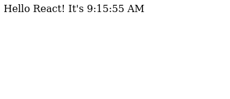

# Pure React Project

This project is a simple React application that displays the current time, updating every second.

## Table of Contents

- [Installation](#installation)
- [Usage](#usage)
- [Project Structure](#project-structure)
- [Code Explanation](#code-explanation)
- [License](#license)

## Screenshot

<p align="center">
  
</p>

## Installation

To run this project, you don't need any specific installation steps for React or ReactDOM, as it uses the UMD (Universal Module Definition) builds from a CDN. Simply open the `index.html` file in a web browser.

## Usage

1. Clone the repository
   ```bash
   git clone https://github.com/Jonahida/react-ultimate-course-2024.git
   cd react-ultimate-course-2024/part-01-fundamentals/01-pure-react/
   ```

You can also download `index.html` file only.

2. Open the `index.html` file in any modern web browser.

The application will display the current time and update every second.

## Project Structure

This project consists of a single `index.html` file with the following structure:

```html
<!DOCTYPE html>
<html lang="en">
  <head>
    <meta charset="UTF-8" />
    <meta name="viewport" content="width=device-width, initial-scale=1.0" />
    <title>Hello React!</title>
  </head>
  <body>
    <div id="root"></div>

    <script src="https://unpkg.com/react@18/umd/react.development.js"></script>
    <script src="https://unpkg.com/react-dom@18/umd/react-dom.development.js"></script>
    <script>
      function App() {
        const [time, setTime] = React.useState(new Date().toLocaleTimeString());
        React.useEffect(function () {
          setInterval(function () {
            setTime(new Date().toLocaleTimeString());
          }, 1000);
        }, []);
        return React.createElement("header", null, `Hello React! It's ${time}`);
      }

      const root = ReactDOM.createRoot(document.getElementById("root"));
      root.render(React.createElement(App));
    </script>
  </body>
</html>
```

# Code Explanation

## HTML Structure

`<div id="root"></div>`: The root element where the React application will be rendered.
`<script src="https://unpkg.com/react@18/umd/react.development.js"></script>`: Includes the React library.
`<script src="https://unpkg.com/react-dom@18/umd/react-dom.development.js"></script>`: Includes the ReactDOM library.

## JavaScript Code

1. **App Component**:

- Defines a functional component `App` using React.

- Uses the `useState` hook to manage the time state, initialized with the current time.

- Uses the `useEffect` hook to set up an interval that updates the time state every second.

2. **Rendering the App**:

- Creates a root element using `ReactDOM.createRoot`.
- Renders the `App` component into the root element.

## React Hooks

- `useState`: Manages state within the component.
- `useEffect`: Runs a side-effect (setting up the interval) after the component mounts.

## Dynamic Time Update

- `setInterval`: Calls a function to update the time state every second, ensuring the displayed time is current.

# License

This project is open-source and available under the MIT License.
