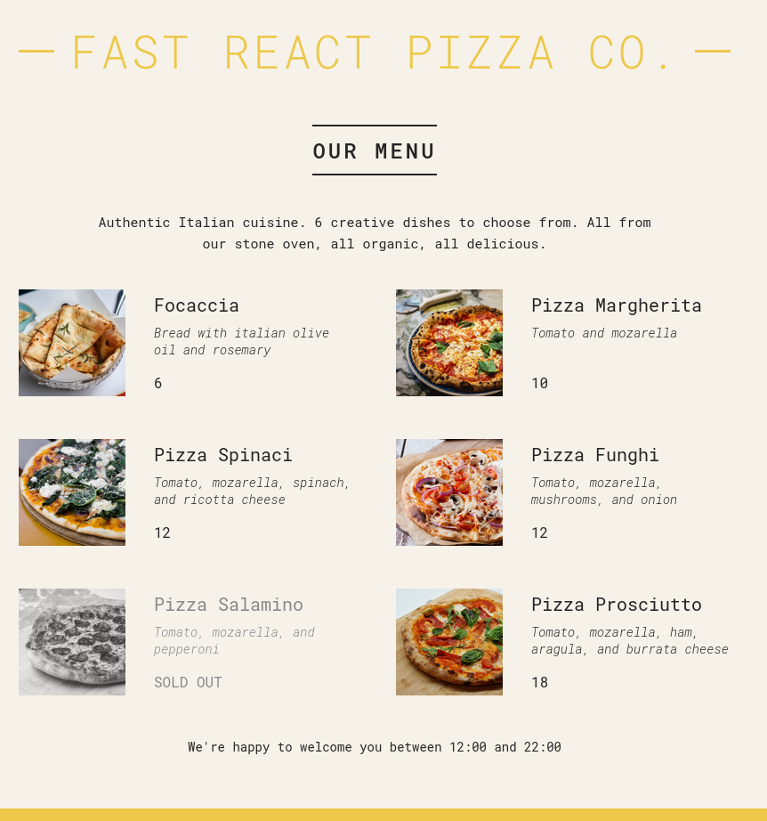

# React Pizza Co. Web App

## Table of Contents
- [Screenshot](#screenshot)
- [Overview](#overview)
- [Code Structure](#code-structure)
  - [Pizza Data](#pizza-data)
  - [Components](#components)
    - [App Component (`App`)](#app-component-app)
    - [Header Component (`Header`)](#header-component-header)
    - [Menu Component (`Menu`)](#menu-component-menu)
    - [Pizza Component (`Pizza`)](#pizza-component-pizza)
    - [Footer Component (`Footer`)](#footer-component-footer)
    - [Order Component (`Order`)](#order-component-order)
  - [React Rendering](#react-rendering)
- [Concepts Demonstrated](#concepts-demonstrated)
- [Technologies Used](#technologies-used)
- [How to Run](#how-to-run)

## Screenshot



## Overview

This React web application showcases a pizza menu for "Fast React Pizza Co." It includes components for displaying pizzas, a header, and a footer that dynamically shows the current open hours.

## Code Structure

### Pizza Data

The application starts with an array `pizzaData` containing details of various pizzas, including name, ingredients, price, photo path, and availability status.

### Components

#### App Component (`App`)

The root component of the application, `App`, renders the entire layout including `Header`, `Menu`, and `Footer`.

#### Header Component (`Header`)

Displays the company name "Fast React Pizza Co." using a styled `<h1>` header.

#### Menu Component (`Menu`)

- **Dynamic Rendering**: Displays a list of pizzas fetched from `pizzaData`.
- **Conditional Rendering**: Shows either the list of pizzas or a message when no pizzas are available.
- **Child Component**: Uses `Pizza` component to render each pizza item.

#### Pizza Component (`Pizza`)

- **Props**: Receives `pizzaObj` as a prop containing details of each pizza.
- **Conditional Styling**: Applies a `sold-out` class if `pizzaObj.soldOut` is true.
- **Dynamic Content**: Displays pizza name, ingredients, price, and a "SOLD OUT" label if the pizza is not available.

#### Footer Component (`Footer`)

- **Current Time Calculation**: Determines if the restaurant is currently open based on the current time.
- **Conditional Rendering**: Displays either an order component (`Order`) or a message about the opening hours.

#### Order Component (`Order`)

- **Props**: Receives `openHour` and `closeHour` to display restaurant opening hours and an "Order" button.

### React Rendering

The application uses `ReactDOM.createRoot` to render the `App` component into the DOM, wrapped in `React.StrictMode` for better development experience and debugging.

## Concepts Demonstrated

- **Component Structure**: How components are organized to manage different parts of the UI.
- **Props and State**: Passing data through props (`pizzaObj`, `openHour`, `closeHour`) and managing state implicitly.
- **Conditional Rendering**: Displaying different content based on conditions (e.g., `numPizzas > 0`).
- **Styling**: Applying styles dynamically using inline styles and conditional classes (`sold-out`).
- **React Hooks**: Not explicitly used in this code but relevant for state management in more complex applications.

## Technologies Used

- **React**: JavaScript library for building user interfaces.
- **ReactDOM**: Library for rendering React components into the DOM.
- **CSS**: Stylesheets (`index.css`) for layout and design.

## How to Run

To run the React Pizza Co. web application locally:

1. **Clone Repository**: Clone the repository containing all project files.

   ```bash
   git clone https://github.com/Jonahida/react-ultimate-course-2024.git
   cd react-ultimate-course-2024/part-01-fundamentals/03-pizza-menu/
   ```

2. **Install Dependencies**: Ensure Node.js and npm (Node Package Manager) are installed. Install project dependencies using npm.

   ```bash
   npm install
   ```

3. **Start Development Server**: Start the development server which will automatically open the application in your default web browser.

   ```bash
   npm start
   ```

4. **View Application**: Once the development server has started, open your web browser and navigate to `http://localhost:3000` (or the specified port if different) to view the React Pizza Co. web application.
