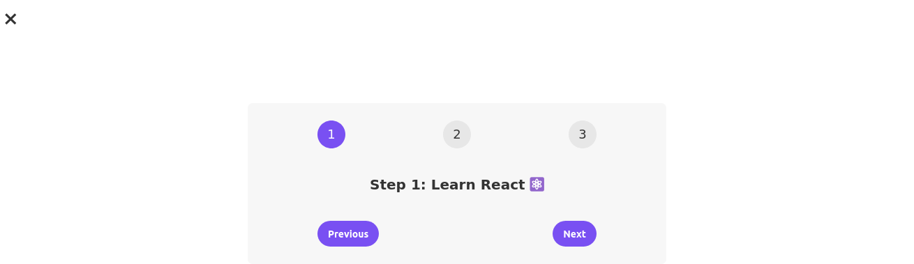

# Steps Application

## Overview

This is a simple steps application built with React. It displays a series of steps with messages, and provides buttons to navigate through these steps. Users can click "Next" to proceed to the next step and "Previous" to go back to the previous step. The application demonstrates the use of React components, state management using the `useState` hook, and conditional rendering.

## Screenshot



## Installation

1. **Install dependencies**

   ```bash
   npm install
   ```

2. **Start the application**

   ```bash
   npm start
   ```

   The application will run on `http://localhost:3000`.

## Usage

- Open the application in your browser.
- Click on "Next" to go to the next step.
- Click on "Previous" to go back to the previous step.
- Click the close button (`&times;`) to toggle the display of the steps.

## Code Explanation

### App Component

The `App` component renders two instances of the `Steps` component.

```jsx
import { useState } from "react";

const messages = [
  "Learn React ⚛️",
  "Apply for jobs 💼",
  "Invest your new income 🤑",
];

export default function App() {
  return (
    <div>
      <Steps />
    </div>
  );
}
```
