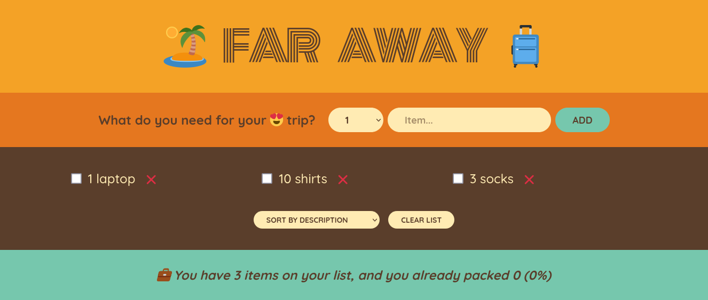

# Travel list

## Overview

A simple React application to manage your packing list for trips. Users can add items, mark them as packed, delete them, and view statistics about their packing progress.


## Screenshot



## File Descriptions

### App.js

`App.js` is the main component that manages the state and logic of the application. It integrates other components like `Logo`, `Form`, `PackingList`, and `Stats` to provide a complete packing list experience.

### Logo.js

`Logo.js` is a simple component that renders the application's logo.

### Form.js

`Form.js` is a component that provides a form for adding new items to the packing list. Users can input the item description and quantity.

### PackingList.js

`PackingList.js` is a component that renders the list of items. It includes functionality for sorting items by input order, description, or packed status and clearing the list.

### Stats.js

`Stats.js` is a component that displays statistics about the packing list, such as the total number of items and the percentage of items packed.

### Items.js

`Items.js` is a component that renders individual items in the packing list. Each item includes a checkbox to toggle its packed status, a description, and a delete button.

## How to Run

To run the Steps web application locally:

1. **Clone Repository**: Clone the repository containing all project files.

```bash
git clone https://github.com/Jonahida/react-ultimate-course-2024.git
cd react-ultimate-course-2024/part-01-fundamentals/05-travel-list/
```

2. **Install dependencies**

```bash
npm install
```

3. **Start the application**

```bash
npm start
```

The application will run on `http://localhost:3000`.

## Usage

Once the application is running, users can:

- **Add Items**: Use the form to input the description and quantity of items you need for your trip.
- **Toggle Packed Status**: Click the checkbox next to an item to mark it as packed or unpacked.
- **Delete Items**: Click the delete button (❌) next to an item to remove it from the list.
- **Clear List**: Use the "Clear list" button to remove all items from the list after a confirmation prompt.
- **Sort Items**: Use the dropdown menu to sort items by input order, description, or packed status.
- **View Stats**: Check the statistics at the bottom of the page to see the total number of items and the percentage of items packed.
