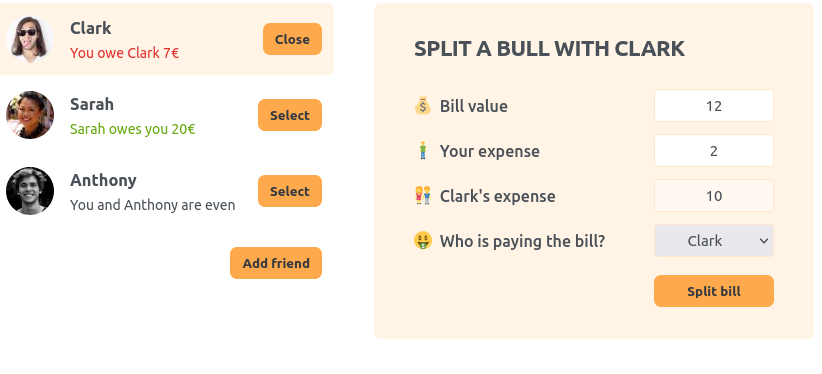

# Friends Management App

A React application for managing friends and splitting bills.

## Overview

This React application allows users to manage their friends list and split bills between them.

## Screenshot



## How to Run

To run the Friends Management App web application locally:

1. **Clone Repository**: Clone the repository containing all project files.

```bash
git clone https://github.com/Jonahida/react-ultimate-course-2024.git
cd react-ultimate-course-2024/part-01-fundamentals/06-eat-n-split/
```

2. **Install dependencies**

```bash
npm install
```

3. **Start the application**

```bash
npm start
```

The application will run on `http://localhost:3000`.

## Technologies Used

- React
- HTML5
- CSS3

## Components

#### 1. `App`

The main component that holds the state for the friends list, shows the form to add a new friend, and handles splitting bills.

#### 2. `FriendsList`

A component that displays the list of friends.

#### 3. `Friend`

A component that displays a single friend's details.

#### 4. `Button`

A button component used throughout the application.

#### 5. `FormAddFriend`

A form component for adding a new friend.

#### 6. `FormSplitBill`

A form component for splitting a bill with a selected friend.

## Usage

- View the list of friends in the sidebar.
- Click "Add friend" to show the form for adding a new friend.
- Select a friend from the list to split a bill with them.
- Use the form to input bill details and split the amount.
