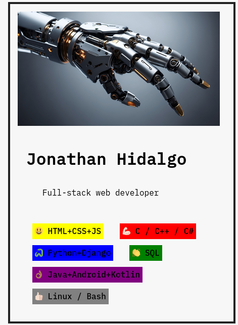

# Developer Portfolio

A simple React application showcasing a developer portfolio with skills and profile information.


## Overview

This React application displays a developer portfolio featuring Jonathan Hidalgo. It includes an avatar, an introduction section, and a list of skills represented by emoji icons.

## Screenshot




## How to Run

To run the Steps web application locally:

1. **Clone Repository**: Clone the repository containing all project files.

```bash
git clone https://github.com/Jonahida/react-ultimate-course-2024.git
cd react-ultimate-course-2024/part-01-fundamentals/challenge-01-profile-card/
```

2. **Install dependencies**

```bash
npm install
```

3. **Start the application**

```bash
npm start
```

The application will run on `http://localhost:3000`.

## Technologies Used

- React
- HTML5
- CSS3
