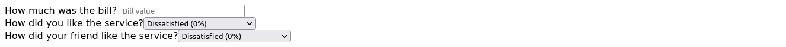

# Tip Calculator

A simple React application for calculating tips based on service satisfaction levels.

## Overview

This React application allows users to input a bill amount and select satisfaction levels for two individuals, then calculates the tip accordingly. The result is the average tip based on the selected satisfaction levels.

## Screenshots

<hr />
### 1. New


<hr />
### 2. Calculate


<hr />

## How to Run

To run the Tip Calculator web application locally:

1. **Clone Repository**: Clone the repository containing all project files.

```bash
git clone https://github.com/Jonahida/react-ultimate-course-2024.git
cd react-ultimate-course-2024/part-01-fundamentals/challenge-01-tip-calculator/
```

2. **Install dependencies**

```bash
npm install
```

3. **Start the application**

```bash
npm start
```

The application will run on `http://localhost:3000`.

## Technologies Used

- React
- HTML5
- CSS3

## Components

#### 1. `App`

The main component that holds the state for the bill and the two percentage values. It includes functions for handling input changes and resetting the form.

#### 2. `BillInput`

A component for inputting the bill amount.

#### 3. `SelectPercentage`

A component for selecting a tip percentage based on service satisfaction.

#### 4. `Output`

A component that calculates and displays the total amount including the tip.

#### 5. `Reset`

A button component to reset the input fields to their initial states.

## Usage

- Enter the bill amount in the "How much was the bill?" field.
- Select the satisfaction levels from the dropdown menus for "How did you like the service?" and "How did your friend like the service?".
- The calculated tip and total amount will be displayed below.
- Use the "Reset" button to clear all inputs.
