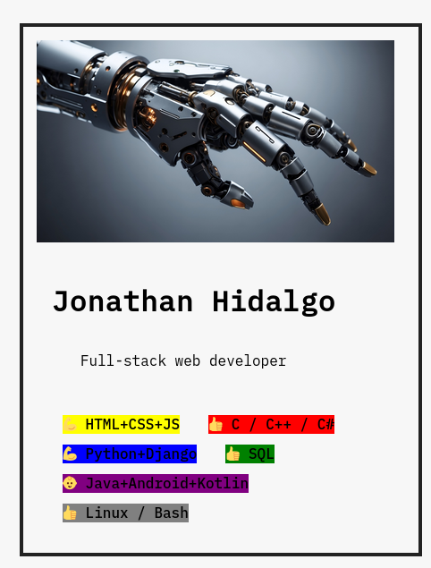

# React Web Developer Portfolio V2 (Updated)

This project showcases an updated version of a portfolio website built with React, showcasing skills and basic information about a web developer.

## Screenshot




## How to Run

To run the Steps web application locally:

1. **Clone Repository**: Clone the repository containing all project files.

```bash
git clone https://github.com/Jonahida/react-ultimate-course-2024.git
cd react-ultimate-course-2024/part-01-fundamentals/challenge-02-profile-card-V2/
```

2. **Install dependencies**

```bash
npm install
```

3. **Start the application**

```bash
npm start
```

The application will run on `http://localhost:3000`.

## Differences from Previous Version

### Component Changes

- **Skill Component**: The Skill component has been updated to accept level and color directly as props instead of calculating them within the component.

### Code Update

- The code now uses an array skills to store skill data, allowing for easier management and rendering of skills.

### UI Changes

- Skills are now displayed with a background color based on the color prop from the skills array.
- Each skill level is represented by an emoji (💪 for advanced, 👍 for intermediate, 👶 for basic).

## Technologies Used

- React
- HTML5
- CSS3