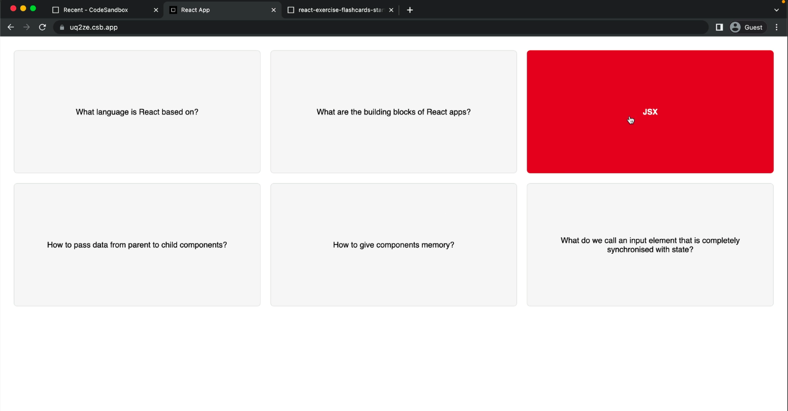

# Flashcard Application

## Overview

This is a simple flashcard application built with React. It displays a list of questions, and clicking on a question will reveal the answer. Clicking the question again will hide the answer. This application demonstrates the use of React components, state management using the `useState` hook, and conditional rendering.

## Screenshot



## How to Run

To run the Steps web application locally:

1. **Clone Repository**: Clone the repository containing all project files.

```bash
git clone https://github.com/Jonahida/react-ultimate-course-2024.git
cd react-ultimate-course-2024/part-01-fundamentals/exercise-01-flashcards/
```

2. **Install dependencies**

```bash
npm install
```

3. **Start the application**

```bash
npm start
```

The application will run on `http://localhost:3000`.

## Usage

- Open the application in your browser.
- Click on a question to reveal the answer.
- Click on the question again to hide the answer.
