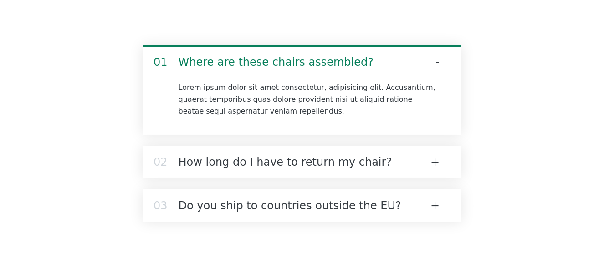

# FAQ Accordion Component

## Overview

This project demonstrates a simple FAQ accordion component built with React. It allows users to expand and collapse FAQ items to view their answers.


## Screenshot



## How to Run

To run the Steps web application locally:

1. **Clone Repository**: Clone the repository containing all project files.

```bash
git clone https://github.com/Jonahida/react-ultimate-course-2024.git
cd react-ultimate-course-2024/part-01-fundamentals/exercise-01-accordion-component-v1/
```

2. **Install dependencies**

```bash
npm install
```

3. **Start the application**

```bash
npm start
```

The application will run on `http://localhost:3000`.


4. **FAQ Accordion Component**:

```jsx
import { useState } from "react";
const faqs = [
 {
   title: "Where are these chairs assembled?",
   text: "Lorem ipsum dolor sit amet consectetur, adipisicing elit...",
 },
 // Add more FAQ items as needed
];
function App() {
 return (
   <div>
     <Accordion data={faqs} />
   </div>
 );
}
function Accordion({ data }) {
 return (
   <div className="accordion">
     {data.map((el, i) => (
       <AccordionItem
         key={el.title}
         title={el.title}
         text={el.text}
         num={i}
       />
     ))}
   </div>
 );
}
function AccordionItem({ num, title, text }) {
 const [isOpen, setIsOpen] = useState(false);
 function handleToggle() {
   setIsOpen((isOpen) => !isOpen);
 }
 return (
   <div className={`item ${isOpen ? "open" : ""}`} onClick={handleToggle}>
     <p className="number">{num <= 9 ? `0${num + 1}` : num + 1}</p>
     <p className="title">{title}</p>
     <p className="icon">{isOpen ? "-" : "+"}</p>
     {isOpen && <div className="content-box">{text}</div>}
   </div>
 );
}

export default App;
```

## Code Explanation

### App Component

The `App` component is the entry point of the application. It renders the `Accordion` component, passing the `faqs` data as a prop.

### Accordion Component

The `Accordion` component receives the `faqs` data array as props and maps over it to render multiple `AccordionItem` components. Each `AccordionItem` represents an individual FAQ item.

### AccordionItem Component

The `AccordionItem` component renders an individual FAQ item. It manages its own state (`isOpen`) to toggle the visibility of the answer (`text`) when the FAQ item is clicked.

- **State Management (`useState`)**: Manages the `isOpen` state to control whether the FAQ answer is displayed or hidden.
- **Toggle Function (`handleToggle`)**: Toggles the `isOpen` state when an FAQ item is clicked, allowing users to expand or collapse the answer.


This structure allows for a customizable FAQ accordion component that can be easily integrated into your React projects to display and manage frequently asked questions.