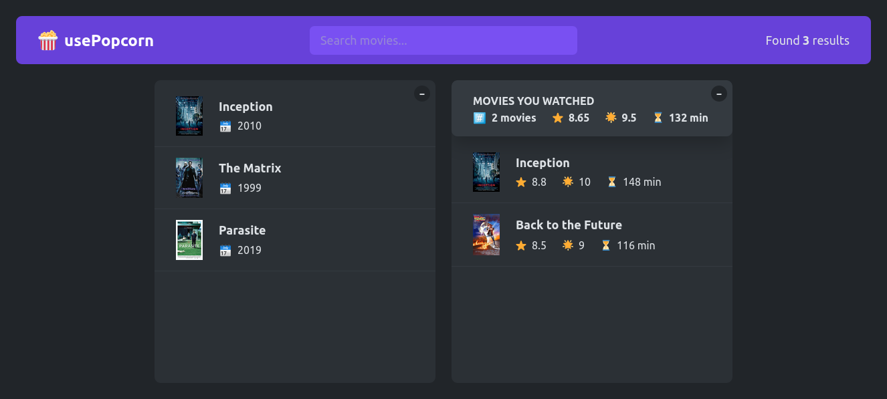

# usePopcorn App

A React application for managing and displaying movie information, including a search feature and watched movie summaries.

## Overview

This React application allows users to browse a collection of movies, search for specific titles, and view details of watched movies, including IMDb ratings and user ratings.

## Screenshot

#### usePopcorn



## How to Run

To run the usePopcorn App web application locally:

1. **Clone Repository**: Clone the repository containing all project files.

```bash
git clone https://github.com/Jonahida/react-ultimate-course-2024.git
cd react-ultimate-course-2024/part-02-intermediate/07-usepopcorn/
```

2. **Install dependencies**

```bash
npm install
```

3. **Start the application**

```bash
npm start
```

The application will run on http://localhost:3000.

## Technologies Used

- React
- HTML5
- CSS3

## Components

1. `App`
   The main component that sets up the application layout and state management.

2. `NavBar`
   A navigation bar component that includes a logo and search functionality.

3. `NumResults`
   Displays the number of search results based on the current query.

4. `Search`
   Allows users to input search queries to filter movie results.

5. `Main`
   Contains the main content of the application, including boxes for displaying movie lists and watched movie summaries.

6. `Box`
   A collapsible box component that toggles between showing and hiding its content.

7. `MovieList`
   Displays a list of movies based on the current search results.

8. `Movie`
   Represents an individual movie item with its title, year, and poster image.

9. `WatchedSummary`
   Provides summary information about watched movies, including average IMDb rating, user rating, and runtime.

10. `WatchedMovieList`
    Displays a list of watched movies with their details.

11. `WatchedMovie`
    Represents an individual watched movie item with its title, IMDb rating, user rating, and runtime.

## Usage

- The `App` initializes the state for movie data and watched movie data using `useState`.

## Star Rating Component

A reusable React component for displaying and setting star ratings.

## Overview

The Star Rating component (StarRating.js) allows users to rate items using a star-based UI. It supports setting a maximum rating, custom colors, sizes, and optional messages for each star rating.

## Screenshot

#### StarRating


## Usage

To use the Star Rating component in your React application:

1. **Install Dependencies**: Ensure you have react and prop-types installed in your project.

```bash
npm install react prop-types
```

2. **Import the Component**: Import the StarRating component into your application where you want to use it.

```jsx
import StarRating from "./StarRating";
```

3. **Use the Component**: Use the StarRating component with desired props to integrate star ratings into your UI.

```jsx
<StarRating
  maxRating={5}
  color="#fcc419"
  size={48}
  messages={["Terrible", "Bad", "Okay", "Good", "Great"]}
  defaultRating={0}
  onSetRating={(rating) => console.log(`Rated ${rating} stars`)}
/>
```

## Props

The `StarRating` component accepts the following props:

- `maxRating` (number): The maximum number of stars to display (default: 5).
- `color` (string): The color of the stars (default: "#fcc419").
- `size` (number): The size of each star in pixels (default: 48).
- `className` (string): Additional CSS class name for styling (default: "").
- `messages` (array): An array of messages corresponding to each star rating (optional).
- `defaultRating` (number): The initial rating to display (default: 0).
- `onSetRating` (function): Callback function invoked when a rating is set (receives rating as parameter).

#### Example

Here's an example of how to use the StarRating component:

```jsx
import React from "react";
import StarRating from "./StarRating";

function MyComponent() {
  const handleSetRating = (rating) => {
    console.log(`Rated ${rating} stars`);
    // Implement logic to save rating to database or state
  };

  return (
    <div>
      <h1>Rate this item</h1>
      <StarRating
        maxRating={5}
        color="#fcc419"
        size={48}
        messages={["Terrible", "Bad", "Okay", "Good", "Great"]}
        defaultRating={0}
        onSetRating={handleSetRating}
      />
    </div>
  );
}

export default MyComponent;
```

## Components

`StarRating`
The main component that handles rendering of stars based on user interactions and props.

`Star`
A sub-component responsible for rendering individual star icons with hover and click interactions.

# Comparison of App.js Versions

This section summarizes the main differences between different versions of the `App.js` file.

## App.js

### State Management
- Uses `useState` for managing query, movies, isLoading, error, and selectedId.
- Uses `useReducer` for managing watched movies.

### Effects
- Fetches movies using `useEffect` and `fetch` API.
- Uses `localStorage` for storing and retrieving watched movies.

### Components
- Contains components for search input (`Search`), movie list (`MovieList`), movie details (`MovieDetails`), and watched movies list (`WatchedMoviesList`).
- Includes `Loader` and `ErrorMessage` components.

### Features
- Allows searching for movies, viewing movie details, adding movies to watched list, and deleting movies from watched list.
- Uses `localStorage` for persistent storage of watched movies.

## App-v1.js

### State Management
- Uses `useState` for managing query, movies, isLoading, error, and selectedId.
- Uses `useState` for watched movies and initializes with an empty array.

### Effects
- Fetches movies using `useEffect` and `fetch` API.
- Uses `localStorage` for storing and retrieving watched movies.

### Components
- Contains components for search input (`Search`), movie list (`MovieList`), movie details (`MovieDetails`), and watched movies list (`WatchedMoviesList`).
- Includes `Loader`, `ErrorMessage`, and `StarRating` components.

### Features
- Allows searching for movies, viewing movie details, adding movies to watched list, and deleting movies from watched list.
- Uses `localStorage` for persistent storage of watched movies.

## App-v2.js

### State Management
- Uses `useState` for managing query, movies, isLoading, error, and selectedId.
- Uses `useState` for watched movies and initializes with an empty array.

### Effects
- Fetches movies using `useEffect` and `fetch` API.
- Uses `localStorage` for storing and retrieving watched movies.

### Components
- Contains components for search input (`Search`), movie list (`MovieList`), movie details (`MovieDetails`), and watched movies list (`WatchedMoviesList`).
- Includes `Loader`, `ErrorMessage`, and `StarRating` components.

### Features
- Allows searching for movies, viewing movie details, adding movies to watched list, and deleting movies from watched list.
- Uses `localStorage` for persistent storage of watched movies.

## App-v3.js

### State Management
- Uses `useState` for managing query, movies, isLoading, error, and selectedId.
- Uses `useState` for watched movies and initializes with `localStorage` value or empty array.

### Effects
- Fetches movies using `useEffect` and `fetch` API with abort controller for cleanup.
- Uses `localStorage` for storing and retrieving watched movies.
- Updates document title dynamically.

### Components
- Contains components for search input (`Search`), movie list (`MovieList`), movie details (`MovieDetails`), watched movie summary (`WatchedSummary`), watched movies list (`WatchedMoviesList`), and collapsible sections (`Box`).
- Includes `Loader`, `ErrorMessage`, `StarRating`, and `Logo` components.

### Features
- Allows searching for movies, viewing movie details, adding movies to watched list, and deleting movies from watched list.
- Dynamically updates document title based on selected movie.
- Organizes content into collapsible sections (`Box` component) for improved user experience.

---

This comparison outlines the evolution and differences between different versions of `App.js`, focusing on state management, effects, component structure, and additional features introduced in each iteration.
