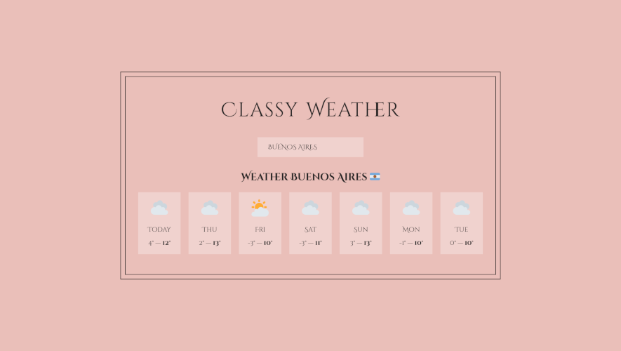

# Classy Weather Application

A simple React application that displays weather information based on user input, with interactive features like state management and conditional rendering.

## Overview

This React application allows users to search for weather information by location. It fetches geocoding data to determine the coordinates of the entered location, retrieves weather information, and displays it with corresponding weather icons. The application also saves the user's last searched location in local storage and restores it on subsequent visits.

## Screenshot



## How to Run

To run the Classy Weather application locally:

1. **Clone Repository**: Clone the repository containing all project files.

```bash
   git clone https://github.com/Jonahida/react-ultimate-course-2024.git
   cd react-ultimate-course-2024/part-02-intermediate/09-classy-weather/
```

2. **Install dependencies**
```bash
npm install
```

3. **Start the application**
```bash
npm start
```

The application will run on http://localhost:3000.

## Technologies Used
- React
- HTML5
- CSS3

## Project Structure
The main components of this application are:

- `App`: The root component that manages state, handles user input, and fetches weather data.
- `Input`: A controlled input component that allows users to enter a location.
- `Weather`: Displays the weather information for the current location.
- `Day`: Displays the weather information for a single day with weather icons, day formatting, and temperature range.

## Functions
- `fetchWeather`: An asynchronous function that fetches geocoding data and weather information based on the user input location.
- `getWeatherIcon`: Maps weather codes to corresponding weather icons.
- `convertToFlag`: Converts a country code to a flag emoji.
- `formatDay`: Formats a date string to a short weekday name.


## Summary of Each Version

#### Version 1 (App-v1.js):

- Uses class components
- Initializes state with a default location
- Fetches weather data on button click
- Demonstrates basic structure and functionality using class components


#### Version 2 (App-v2.js):

- Uses class components
- Implements lifecycle methods for managing state and side effects
- Fetches weather data automatically on mount and state change
- Stores last searched location in local storage


#### Version 3 (App.js):

- Uses functional components and hooks (useState, useEffect)
- Fetches weather data automatically on mount and state change
- Stores last searched location in local storage
- Demonstrates a modern approach to building React applications