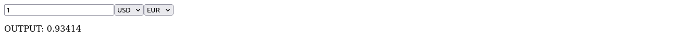

# Currency Converter App
A React application for converting currency using the Frankfurter API. Users can enter an amount, select the currency to convert from and to, and get the converted amount.


## Overview
This application uses the Frankfurter API to convert currency from one type to another based on user input. It provides real-time conversion rates and updates the output dynamically.

## Screenshot



## Features
- Convert currency with real-time exchange rates from the Frankfurter API
- Input amount to convert
- Select currency type to convert from and to
- Display converted amount


To run the usePopcorn App web application locally:

1. **Clone Repository**: Clone the repository containing all project files.

```bash
git clone https://github.com/Jonahida/react-ultimate-course-2024.git
cd react-ultimate-course-2024/part-02-intermediate/challenge-01-currency-converter/
```

2. **Install dependencies**

```bash
npm install
```

3. **Start the application**

```bash
npm start
```

The application will run on http://localhost:3000.

## Usage
1. **Enter Amount**: Input the amount you want to convert.
2. **Select From Currency**: Choose the currency type to convert from using the dropdown.
3. **Select To Currency**: Choose the currency type to convert to using the dropdown.
4. The converted amount will be displayed below.
5. 
## Components
## App Component
Handles state management for amount, fromType (currency to convert from), toType (currency to convert to), and result (converted amount).

## SelectCurrency Component
Dropdown component for selecting currency types (USD, EUR, CAD, INR).

## API Configuration
The application uses the Frankfurter API for fetching real-time exchange rates. Ensure the API URL and parameters are correctly set in the `fetch` function inside `useEffect` in App.js:

```javascript
fetch(`https://api.frankfurter.app/latest?amount=${amount}&from=${fromType}&to=${toType}`)
```