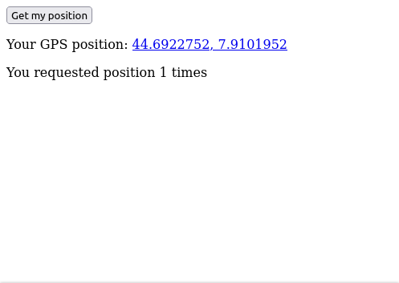

# Geolocation App

A React application showcasing geolocation functionality using hooks (`useState`) and the Geolocation API.

## Overview

This React application demonstrates how to fetch and display the user's GPS coordinates using the Geolocation API. It includes handling for loading states, errors, and displaying the coordinates on a map link.

## Screenshot



## How to Run

To run the Geolocation App web application locally:

1. **Clone Repository**: Clone the repository containing all project files.

```bash
git clone https://github.com/Jonahida/react-ultimate-course-2024.git
cd react-ultimate-course-2024/part-02-intermediate/challenge-01-usegeolocate/
```

2. **Install dependencies**
```bash
npm install
```

3. **Start the application**
```bash
npm start
```

The application will run on http://localhost:3000.

## Technologies Used
- React
- HTML5
- CSS3

## Components
1. `App`
The main component that demonstrates the usage of the TextExpander component with various configurations.

2. `TextExpander`
A component that allows users to expand or collapse long text content.

**Props**
- `children` (node): The text content to be displayed.
- `collapsedNumWords` (number, default: 10): The number of words to display when the text is collapsed.
- `expandButtonText` (string, default: "Show more"): The text to display on the expand button.
- `collapseButtonText` (string, default: "Show less"): The text to display on the collapse button.
- `buttonColor` (string): The color of the expand/collapse button.
- `expanded` (boolean, default: false): The initial state of the text (expanded or collapsed).
- `className` (string, default: ""): Additional class names for custom styling.


## Usage
- The `App` component sets up the `TextExpander` component with different configurations to showcase its flexibility.
- Customize the `TextExpander` component by passing the desired props.


## Example
Here's an example of how to use the `TextExpander` component within the `App` component:

```jsx
import React from "react";
import "./styles.css";

export default function App() {
  return (
    <div>
      <TextExpander>
        Space travel is the ultimate adventure! Imagine soaring past the stars
        and exploring new worlds. It's the stuff of dreams and science fiction,
        but believe it or not, space travel is a real thing. Humans and robots
        are constantly venturing out into the cosmos to uncover its secrets and
        push the boundaries of what's possible.
      </TextExpander>

      <TextExpander
        collapsedNumWords={20}
        expandButtonText="Show text"
        collapseButtonText="Collapse text"
        buttonColor="#ff6622"
      >
        Space travel requires some seriously amazing technology and
        collaboration between countries, private companies, and international
        space organizations. And while it's not always easy (or cheap), the
        results are out of this world. Think about the first time humans stepped
        foot on the moon or when rovers were sent to roam around on Mars.
      </TextExpander>

      <TextExpander expanded={true} className="box">
        Space missions have given us incredible insights into our universe and
        have inspired future generations to keep reaching for the stars. Space
        travel is a pretty cool thing to think about. Who knows what we'll
        discover next!
      </TextExpander>
    </div>
  );
}

function TextExpander({
  children,
  collapsedNumWords = 10,
  expandButtonText = "Show more",
  collapseButtonText = "Show less",
  buttonColor,
  expanded = false,
  className = ""
}) {
  const style = {
    color: buttonColor
  };
  const [isExpanded, setIsExpanded] = useState(expanded);

  function onButtonClick() {
    setIsExpanded(!isExpanded);
  }

  return (
    <div className={className}>
      {isExpanded ? (
        children + " "
      ) : (
        children.trim().split(/\s+/).slice(0, collapsedNumWords).join(" ") +
        "... "
      )}
      <a style={style} href="#" onClick={onButtonClick}>
        {isExpanded ? collapseButtonText : expandButtonText}
      </a>
    </div>
  );
}
```