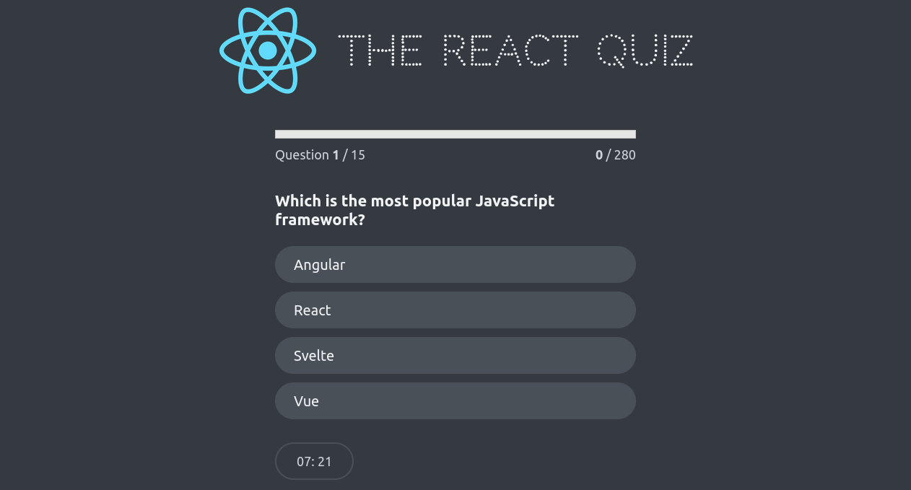

# React Quiz Application

A React quiz game.

## Overview

The project is a React-based quiz application that allows users to answer a series of questions within a set time limit and provides feedback on their performance. It includes various components for managing quiz state, rendering UI elements, and handling user interactions.

## Screenshot



## How to Run

To run the Tabbed Content application locally:

1. **Clone Repository**: Clone the repository containing all project files.

```bash
   git clone https://github.com/Jonahida/react-ultimate-course-2024.git
   cd react-ultimate-course-2024/part-03-advanced/10-react-quiz/
```

2. **Install dependencies**
```bash
npm install
```

3. **Start the application**
```bash
npm start
```

The application will run on http://localhost:3000.

## Technologies Used
- React
- HTML5
- CSS3

## Project Structure
The main components of this application are:

1. **index.js**
   - Initializes the React application and renders the `<App />` component into the DOM.

2. **App.js**
   - Manages quiz state using `useReducer`.
   - Fetches quiz questions from a local server using `fetch`.
   - Controls states (`loading`, `error`, `ready`, `active`, `finished`) for quiz flow.
   - Renders components like `Header`, `Main`, `Footer`, `Question`, `Progress`, `StartScreen`, `FinishScreen`, and `Timer`.

3. **DateCounter.js**
   - Manages a count and step value with `useReducer`.
   - Allows users to adjust the count, affecting a date displayed based on the count.

4. **Error.js**
   - Displays an error message when quiz data fetching fails.

5. **FinishScreen.js**
   - Displays user's score and allows quiz restart after completion.

6. **Footer.js**
   - Renders children components within a `<div>`.

7. **Header.js**
   - Displays a header with a logo and title for the quiz application.

8. **Loader.js**
   - Renders a loading indicator while quiz questions are fetched.

9. **Main.js**
   - Wrapper component for the main content, renders children within a `<main>` tag.

10. **NextButton.js**
    - Renders a button to proceed to the next question or finish the quiz.

11. **Options.js**
    - Renders multiple choice options for a quiz question and handles user selection.

12. **Progress.js**
    - Displays progress information during the quiz, including question number, score, and progress bar.

13. **Question.js**
    - Displays a single quiz question along with answer options.

14. **StartScreen.js**
    - Initial screen prompting users to start the quiz.

15. **Timer.js**
    - Displays a countdown timer during the quiz using `useEffect`.