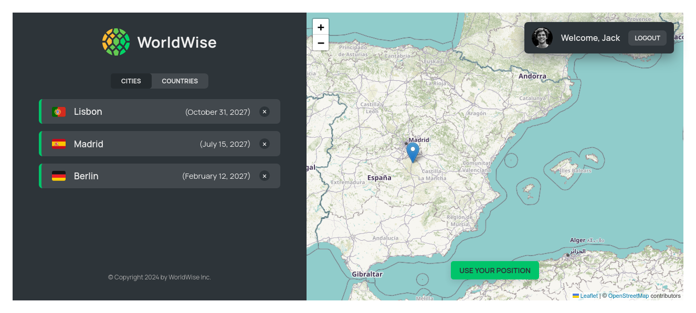

# The City Explorer

A React application to explore cities and countries with authentication and protected routes.

## Overview

The project is a React-based application that provides information on cities and countries. It includes various pages and components for managing application state, rendering UI elements, and handling user interactions. The application also features authentication and protected routes to secure certain parts of the app. Additionally, users can add cities directly from a map using Leaflet maps.

## Screenshot



## How to Run

To run The City Explorer application locally:

1. **Clone Repository**: Clone the repository containing all project files.

```bash
git clone https://github.com/Jonahida/react-ultimate-course-2024.git
cd react-ultimate-course-2024/part-03-advanced/11-worldwise/
```

2. **Install dependencies**

```bash
npm install
```

3. **Start the application**

```bash
npm start
```

The application will run on `http://localhost:3000`.

## Technologies Used

- React
- React Router
- Context API

## Project Structure

The main components of this application are:

1. **App.js**

   - The root component that sets up routing, context providers, and the main application layout.

2. **contexts/FakeAuthContext.js**

   - Provides a fake authentication context to manage user login state.

3. **contexts/CitiesContext.js**

   - Provides a context to manage city data.


4. **pages**
- **Homepage.js**: The main landing page.
- **Product.js**: Displays product information.
- **Pricing.js**: Displays pricing information.
- **Login.js**: The login page for user authentication.
- **AppLayout.js**: The protected layout that contains nested routes.
- **PageNotFound.js**: Displays a 404 error for undefined routes.
- **ProtectedRoute.js**: A component to protect routes and ensure they are only accessible to authenticated users.

5. **components**
- **CityList.js**: Displays a list of cities.
- **CountryList.js**: Displays a list of countries.
- **City.js**: Displays details for a specific city.
- **Form.js**: A form component for user input.

## Context Providers
- **AuthProvider**: Manages user authentication state.
- **CitiesProvider**: Manages city data and provides it to the components.

## Protected Routes
- The `ProtectedRoute` component ensures that only authenticated users can access certain routes. It wraps the `AppLayout` component and its nested routes.