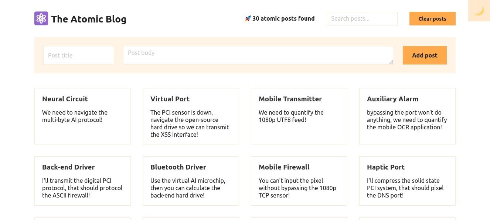

# The Atomic Blog

A simple blog application built with React.

## Overview

The project is a React-based blog application that allows users to add, search, and display posts. It includes various components for managing blog state, rendering UI elements, and handling user interactions. The application also features a dark mode toggle and a post archive with a large number of sample posts.

## Screenshot



## How to Run

To run The Atomic Blog application locally:

1. **Clone Repository**: Clone the repository containing all project files.

```bash
git clone https://github.com/Jonahida/react-ultimate-course-2024.git
cd react-ultimate-course-2024/part-03-advanced/12-atomic-blog/
```

2. **Install dependencies**

```bash
npm install
```

3. **Start the application**

```bash
npm start
```

The application will run on `http://localhost:3000`.

## Technologies Used

- React
- HTML5
- CSS3
- Faker.js

## Project Structure

The main components of this application are:

1. **index.js**

   - Initializes the React application and renders the `<App />` component into the DOM.

2. **PostContext.js**

   - Defines the context and provider for managing posts in the application.
   - Includes functionalities for adding, clearing, and searching posts.

3. **App-v1.js (Version 1)**

   - Manages the main structure and state of the application.
   - Includes components for toggling dark mode, displaying header, main content, post archive, and footer.
   - Context values are provided directly in the `App` component.

4. **App.js (Version 2)**

   - Similar to Version 1 but uses a separate `PostProvider` for managing context values.
   - Context values and state management are abstracted into the `PostProvider` component.
