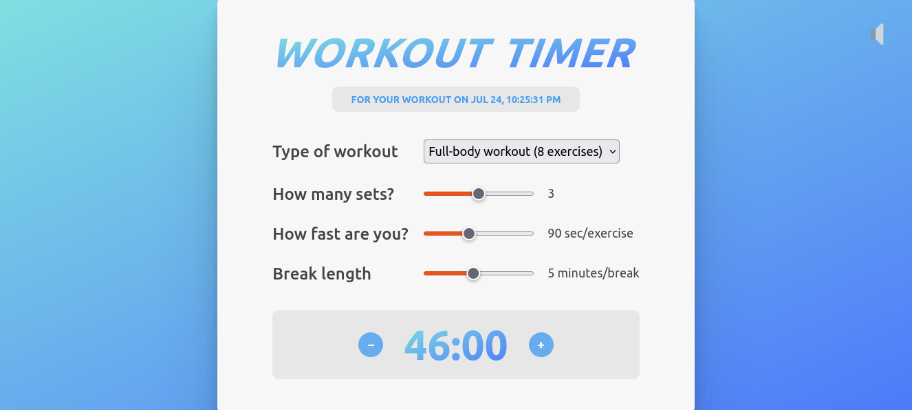

# Workout Timer

A simple blog application built with React.

## Overview

The project is a React-based application that allows users to select the type of workout, number of sets, the time duration of each exercise and the brek lengthsearch, and display posts. The main App component includes two components a calculator to get the total time and a compoentns that enable or disable sounds.

## Screenshot



## How to Run

To run Workout Timer application locally:

1. **Clone Repository**: Clone the repository containing all project files.

```bash
git clone https://github.com/Jonahida/react-ultimate-course-2024.git
cd react-ultimate-course-2024/part-03-advanced/13-workout-timer/
```

2. **Install dependencies**

```bash
npm install
```

3. **Start the application**

```bash
npm start
```

The application will run on `http://localhost:3000`.

## Technologies Used

- React
- HTML5
- CSS3
- Faker.js

## Project Structure

The main components of this application are:

1. **index.js**

   - Initializes the React application and renders the `<App />` component into the DOM.

2. **Calculator.js**

   - Includes functionalities to setup the timer.

3. **ToggleSounds.js**

   - Button to enable or disable page sounds.

4. **App.js**

   - Main application component.