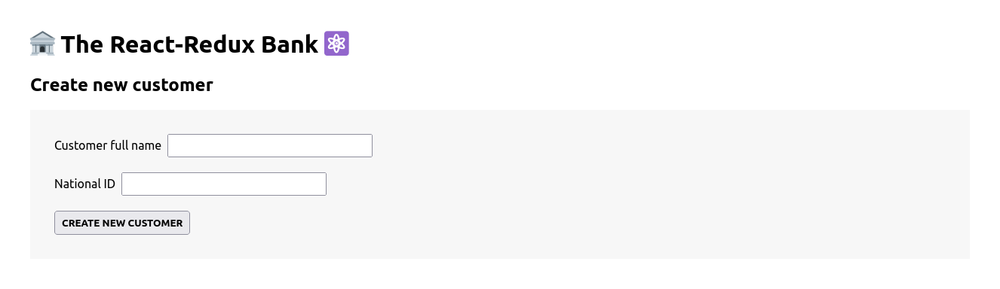

# The React-Redux Bank

A React application for managing customer accounts with Redux for state management.

This project demonstrates the use of React and Redux for state management, including async actions and middleware for handling side effects such as currency conversion. It provides a simple banking interface with customer and account management features.

## Overview

The project is a React-based application that provides functionality to manage customer accounts, including creating customers, handling account operations, and displaying account balances. It leverages Redux for state management, with various slices to manage account and customer data.

## Screenshot



## How to Run

To run The React-Redux Bank application locally:

1. **Clone Repository**: Clone the repository containing all project files.

   ```bash
   git clone https://github.com/Jonahida/react-ultimate-course-2024.git
   cd react-ultimate-course-2024/part-03-advanced/15-redux-intro/
   ```

2. **Install dependencies**

   ```bash
   npm install
   ```

3. **Start the application**

   ```bash
   npm start
   ```

   The application will run on `http://localhost:3000`.

## Technologies Used

- React
- Redux
- Redux Toolkit

## Project Structure

The main components and files of this application are:

1- **index.js**
Entry point of the application. Sets up the React app with Redux Provider.

2- **App.js**
Root component that conditionally renders the CreateCustomer component or the customer-related components based on whether a customer is created.

3- **store.js**
Configures and exports the Redux store with the account and customer reducers using Redux Toolkit's configureStore.

4- **store-v1.js**
Initial store setup without Redux Toolkit, using plain Redux for managing account and customer state.

5- **store-v2.js**
Redux store setup using plain Redux with middleware (Thunk) and Redux DevTools integration.

## Features/Accounts

1- **AccountOperations.js**
Component for handling account operations like deposit, withdrawal, requesting a loan, and paying a loan. Uses Redux actions and state.

2- **accountSlice.js**
Redux slice for account-related state and actions. Defines reducers and async actions for handling currency conversion and account updates.

3- **BalanceDisplay.js**
Component for displaying the current account balance. Connected to the Redux store to retrieve the balance.

## Features/Customers

1- **CreateCustomer.js**
Component for creating a new customer. Captures customer details and dispatches the createCustomer action.

2- **Customer.js**
Component for displaying a welcome message to the created customer. Uses Redux state to get the customer's name.

3- **customerSlice.js**
Redux slice for customer-related state and actions. Defines reducers for creating and updating customer information.
