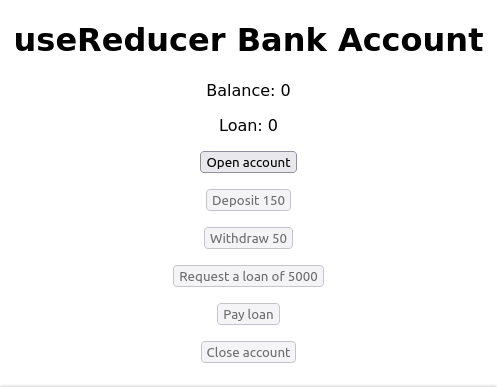

# useReducer Bank Account

## Overview

This application simulates a simplified bank account management system using React's `useReducer` hook. It allows users to perform operations like opening an account, depositing money, withdrawing money, requesting loans, paying off loans, and closing the account under specific conditions.

### Instructions and Considerations

1. **Operations**: Use the reducer to model the state transitions for:

   - Opening an account (`openAccount`)
   - Depositing money (`deposit`)
   - Withdrawing money (`withdraw`)
   - Requesting a loan (`requestLoan`)
   - Paying off a loan (`payLoan`)
   - Closing the account (`closeAccount`)

2. **Active Status**: All operations (except opening an account) can only be performed if `isActive` is `true`. If `isActive` is `false`, the original state object should be returned.

3. **Opening an Account**: When opening an account, `isActive` is set to `true`, and a minimum deposit of 500 is required (`balance` starts at 500).

4. **Loan Handling**: Customers can only request a loan if no loan is currently active (`loan` is 0). The requested amount is added to the `loan` state and the `balance`.

5. **Paying Off Loans**: When paying off a loan, the money is deducted from the `balance`, and the `loan` state returns to 0.

6. **Closing an Account**: An account can only be closed if there is no active loan (`loan` is 0) and the `balance` is zero. If these conditions are met, the account is deactivated (`isActive` set to `false`) and all money is withdrawn, resetting the account to its initial state.

### How to Use

To interact with the bank account simulation:

1. **Open Account**: Click the "Open account" button to start. This initializes the account with a balance of 500.

2. **Deposit**: Deposit money into the account by clicking the "Deposit" button.

3. **Withdraw**: Withdraw money from the account using the "Withdraw" button.

4. **Request Loan**: Request a loan by clicking the "Request a loan" button. This adds the loan amount to the account balance.

5. **Pay Loan**: Pay off an existing loan using the "Pay loan" button. This deducts the loan amount from the account balance.

6. **Close Account**: Close the account by clicking the "Close account" button. This deactivates the account and withdraws all money if there is no active loan and the balance is zero.

### Technologies Used

- React
- JavaScript (ES6+)

### Screenshot

Include a screenshot of the application here, showcasing the bank account interface.

### Additional Notes

This project includes two versions of the implementation:

- `App.js`: This version was implemented by myself. It includes an additional `canCloseAccount` state property to manage the conditions for closing the account more explicitly and provides a more detailed control over state updates.
- `App-v1.js`: This version is the solution provided for the challenge. It features a simpler state update logic and does not include the `canCloseAccount` property. Instead, it directly manages state transitions based on `isActive`, `balance`, and `loan`.
