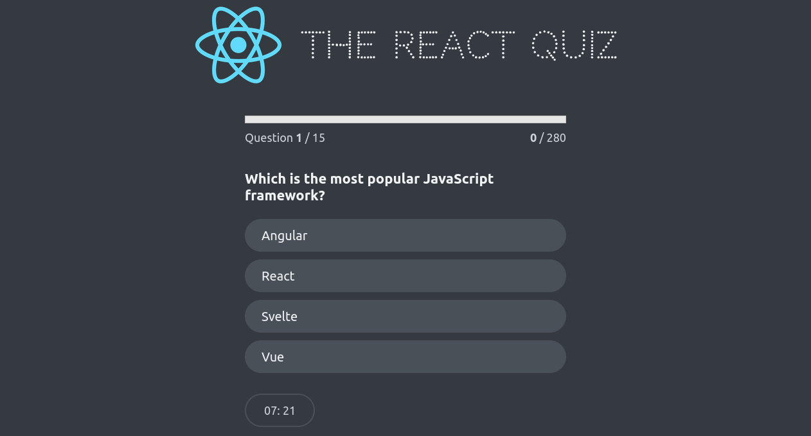

# React Quiz Application

A React quiz game.

## Overview

The project is a React-based quiz application that allows users to answer a series of questions within a set time limit and provides feedback on their performance. It includes various components for managing quiz state, rendering UI elements, and handling user interactions. The application now utilizes the Context API and `useReducer` hook for advanced state management.

## Screenshot



## How to Run

To run the React Quiz application locally:

1. **Clone Repository**: Clone the repository containing all project files.

   ```bash
   git clone https://github.com/Jonahida/react-ultimate-course-2024.git
   cd react-ultimate-course-2024/part-03-advanced/challenge-02-react-quiz-refactored/
   ```

2. **Install dependencies**

   ```bash
   npm install
   ```

3. **Start the application**

   ```bash
   npm start
   ```

The application will run on http://localhost:3000.

## Technologies Used

- React
- HTML5
- CSS3
- Context API
- useReducer

## Project Structure

The main components of this application are:

1. **index.js**

   - Initializes the React application, sets up the `QuizProvider` context, and renders the `<App />` component into the DOM.

2. **App.js**

   - Manages quiz state using `useReducer`.
   - Fetches quiz questions from a local server using `fetch`.
   - Controls states (`loading`, `error`, `ready`, `active`, `finished`) for quiz flow.
   - Renders components like `Header`, `Main`, `Footer`, `Question`, `Progress`, `StartScreen`, `FinishScreen`, and `Timer`.

3. **QuizContext.js**

   - Defines the context and provider for managing quiz state.
   - Includes functionalities for state management using `useReducer`.
   - Provides a custom hook to consume the context across the application.

4. **DateCounter.js**

   - Manages a count and step value with `useReducer`.
   - Allows users to adjust the count, affecting a date displayed based on the count.

5. **Error.js**

   - Displays an error message when quiz data fetching fails.

6. **FinishScreen.js**

   - Displays the user's score and allows the quiz to be restarted after completion.

7. **Footer.js**

   - Renders children components within a `<div>`.

8. **Header.js**

   - Displays a header with a logo and title for the quiz application.

9. **Loader.js**

   - Renders a loading indicator while quiz questions are fetched.

10. **Main.js**

    - Wrapper component for the main content, renders children within a `<main>` tag.

11. **NextButton.js**

    - Renders a button to proceed to the next question or finish the quiz.

12. **Options.js**

    - Renders multiple choice options for a quiz question and handles user selection.

13. **Progress.js**

    - Displays progress information during the quiz, including question number, score, and progress bar.

14. **Question.js**

    - Displays a single quiz question along with answer options.

15. **StartScreen.js**

    - Initial screen prompting users to start the quiz.

16. **Timer.js**
    - Displays a countdown timer during the quiz using `useEffect`.

## Refactor Details

The project was refactored to use the Context API in combination with the `useReducer` hook to manage the quiz state more efficiently. Here are the steps taken during the refactor:

1. **Duplicate `src` folder**: Created a `src-no-context` folder containing the previous code.
2. **Analyze data flow**: Reviewed how data flowed through the application and identified props drilling issues.
3. **Create `QuizContext`**: Added a `QuizContext.js` file to define the context and reducer.
4. **Custom Provider Component**: Created a custom provider to supply state to the entire application.
5. **Custom Hook**: Created a custom hook for consuming context state across components.
6. **Use Hook in Components**: Replaced props with context state consumption using the custom hook.
7. **Update `index.js`**: Wrapped the `<App />` component with `QuizProvider` to provide context state to the entire application.
