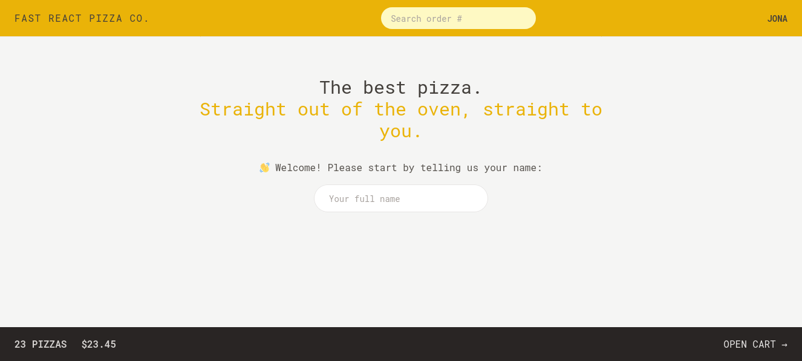

# Fast React Pizza Co.

A web application for ordering pizza built with React.

## Overview

Fast React Pizza Co. is a React-based application that allows users to browse a menu, add items to their cart, and place orders. The application includes various components for managing the state, rendering UI elements, and handling user interactions. It utilizes React Router for client-side routing and Tailwind CSS for styling, providing advanced state management and an improved user experience.

## Screenshot



## How to Run

To run the Fast React Pizza Co. application locally:

1. **Clone Repository**: Clone the repository containing all project files.

   ```bash
   git clone https://github.com/Jonahida/react-ultimate-course-2024.git
   cd react-ultimate-course-2024/part-04-professional-dev/16-fast-react-pizza/
   ```

2. **Install dependencies**

   ```bash
   npm install
   ```

3. **Start the application**

   ```bash
   npm start
   ```

The application will run on http://localhost:3000.

## Technologies Used

- React
- React Router
- Tailwind CSS
- CSS3

## Project Structure

The main components of this application are:

1. **index.html**

   - The entry point for the web application, linking to Google Fonts and including the favicon. It sets up the root element for rendering the React app.

2. **main.jsx**

   - The entry point of the React application. It renders the `App` component inside a `StrictMode` wrapper.

3. **App.jsx**

   - Configures the routes for the application using `react-router-dom`, defines the main layout with `AppLayout`, and handles routing errors with the `Error` component.

4. **index.css**

   - The main CSS file styled with Tailwind CSS.

5. **Home.jsx**

   - Renders the home page of the application.

6. **Error.jsx**

   - Displays error messages when routing or loading fails.

7. **Menu.jsx**

   - Displays the menu items and uses a loader to fetch menu data before rendering.

8. **Cart.jsx**

   - Manages and displays the user's cart items.

9. **CreateOrder.jsx**

   - Manages the order creation process and handles form submissions for creating orders.

10. **Order.jsx**

    - Displays a specific order based on the order ID and uses a loader to fetch order data before rendering.

11. **services/apiGeocoding.jsx**

    - Contains the `getAddress` function to fetch the address based on latitude and longitude using the BigDataCloud API..

12. **services/apiRestaurant.jsx**

    - 13. **services/apiRestaurant.jsx**

    - Contains functions for interacting with the restaurant API:

      - `getMenu`: Fetches the menu items.

        ```jsx
        const API_URL = "https://react-fast-pizza-api.onrender.com/api";

        export async function getMenu() {
          const res = await fetch(`${API_URL}/menu`);
          if (!res.ok) throw Error("Failed getting menu");

          const { data } = await res.json();
          return data;
        }
        ```

      - `getOrder`: Fetches a specific order by ID.

        ```jsx
        export async function getOrder(id) {
          const res = await fetch(`${API_URL}/order/${id}`);
          if (!res.ok) throw Error(`Couldn't find order #${id}`);

          const { data } = await res.json();
          return data;
        }
        ```

      - `createOrder`: Creates a new order.

        ```jsx
        export async function createOrder(newOrder) {
          try {
            const res = await fetch(`${API_URL}/order`, {
              method: "POST",
              body: JSON.stringify(newOrder),
              headers: {
                "Content-Type": "application/json",
              },
            });

            if (!res.ok) throw Error();
            const { data } = await res.json();
            return data;
          } catch {
            throw Error("Failed creating your order");
          }
        }
        ```

      - `updateOrder`: Updates an existing order by ID.

        ```jsx
        export async function updateOrder(id, updateObj) {
          try {
            const res = await fetch(`${API_URL}/order/${id}`, {
              method: "PATCH",
              body: JSON.stringify(updateObj),
              headers: {
                "Content-Type": "application/json",
              },
            });

            if (!res.ok) throw Error();
          } catch (err) {
            throw Error("Failed updating your order");
          }
        }
        ```
